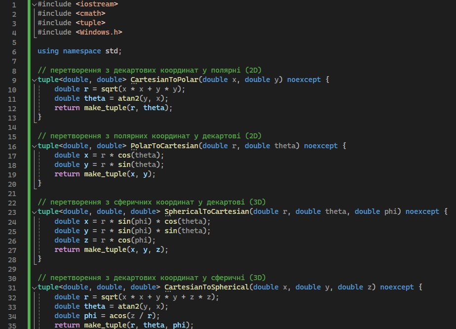
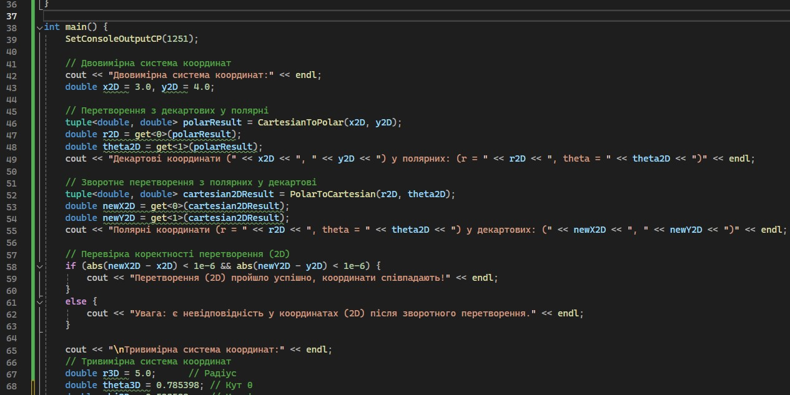
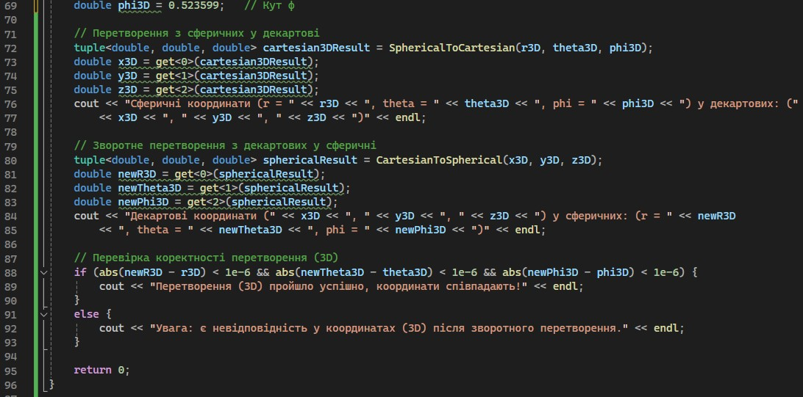
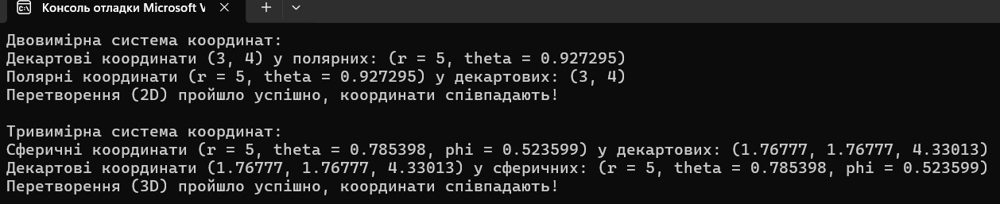
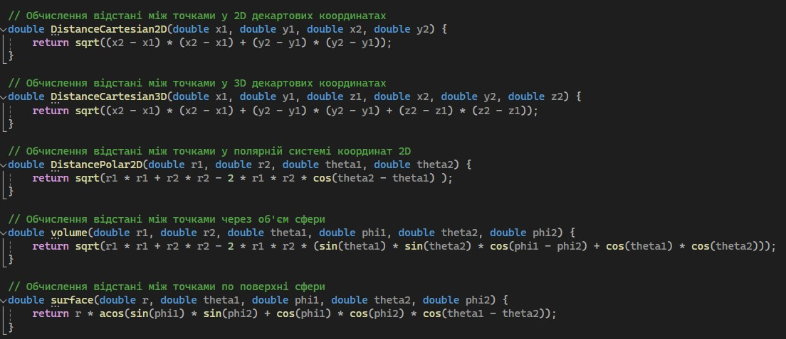
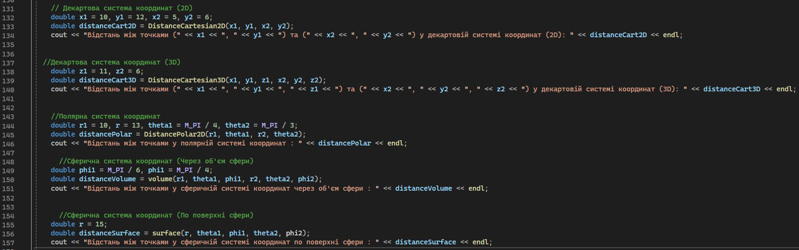
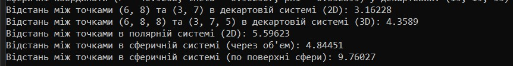
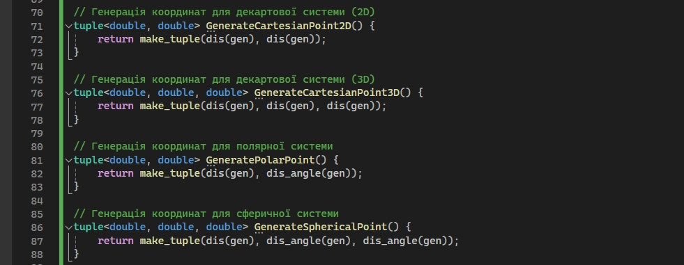
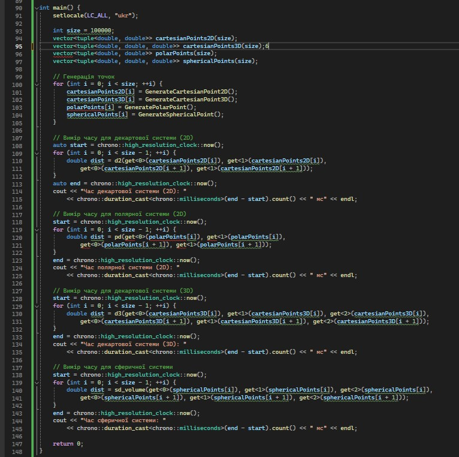
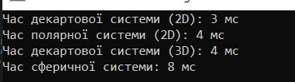

# Реалізація перетворень між системами координат

Мета роботи

Ознайомитися з різними системами координат (декартовою, полярною та сферичною) та отримати практичні навички у переході між ними. Визначити обчислювальну ефективність розрахунку відстаней у цих системах координат через бенчмаркінг.

<h1>Завдання 1.	Перехід між системами координат:</h1>

Двовимірний простір: Декартова та полярна системи координат

Тривимірний простір: Декартова та сферична системи координат

Використовуються функції для перетворення з однієї системи координат в іншу та перевірка коректності перетворення.
Для точності використовується порівняння з малим допуском 1e-6, щоб перевірити, чи співпадають початкові та обернені координати.

Визначивши радіус (r) та кут (θ), було проведено перехід до полярної системи координат для заданих точок у площині, представлених декартовими координатами (x, y). Потім, використовуючи отримані полярні координати, було здійснено зворотне перетворення в декартову систему.

Далі аналогічно провели перехід у декартну систему координат зі сферичної, з'ясувавши x, y, z при відомостях про радіус (r) та кути (θ і φ).

<h1>Завдання 2. Розрахунок відстаней у сферичній системі координат:</h1>

Використовуємо формули для обчислення відстані у двовимірному та тривимірному просторі в декартовій системі, відстані між точками у двовимірному просторі у полярній системі, відстані у тривимірному просторі і для великої колової відстані.

<h1>Завдання 3. Бенчмарки продуктивності:</h1>

Генерація масивів координат пар точок у декартовій, полярній, сферичній системах координат

Розрахунок відстаней між цими точками для кожної системи координат.

Виміри тривалості обчислень для кожної системи координат

Результат:

